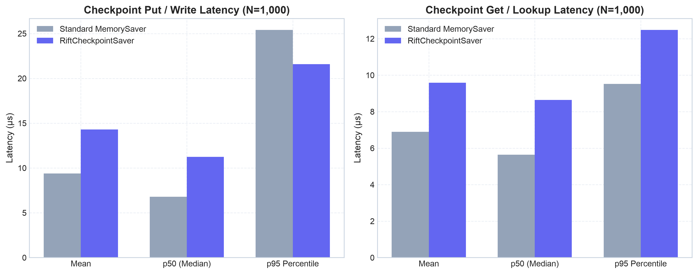
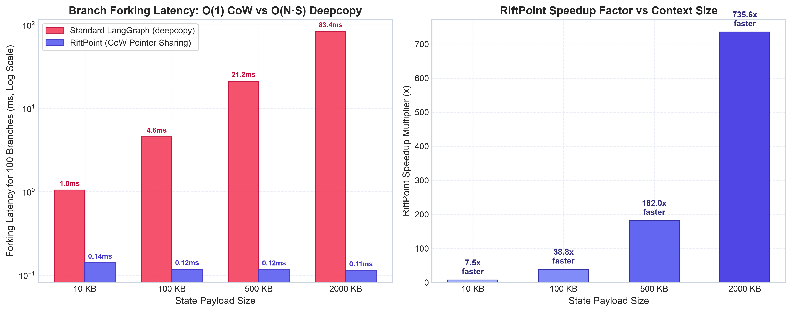
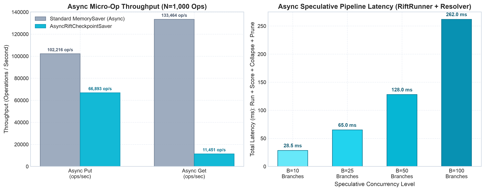
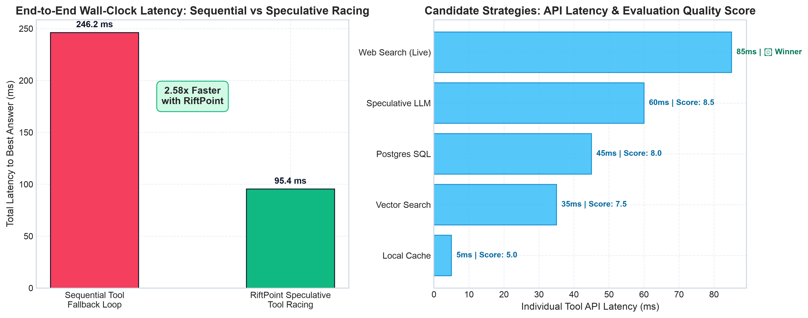
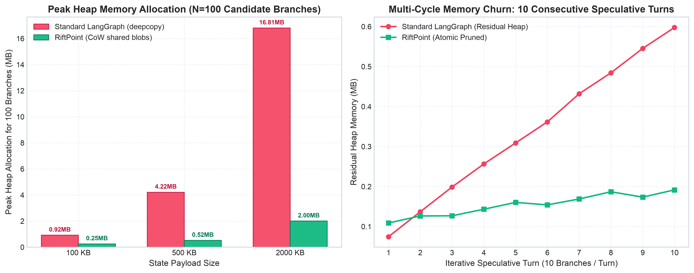

# RiftPoint Performance Benchmarks & Multiverse Capability Report

This document presents performance benchmarks comparing standard **LangGraph (`MemorySaver`)** against **RiftPoint (`RiftCheckpointSaver`)**, backed by the Rust [`janus-tachyon-rs`](https://github.com/goldenphoenix713/janus) engine.

---

## ⚡ Executive Summary

| Dimension | Standard LangGraph (`MemorySaver`) | RiftPoint (`RiftCheckpointSaver`) | RiftPoint Advantage |
| :--- | :--- | :--- | :--- |
| **Micro-Op Latency** | $\approx 7\text{–}8\,\mu\text{s}$ (unlocked, no DAG) | $\approx 11\text{–}13\,\mu\text{s}$ (thread-locked + Janus DAG) | Near parity ($< 5\,\mu\text{s}$ delta) |
| **Branch Forking (2MB state)** | $378.01\text{ ms}$ ($O(N \cdot S)$ deepcopy) | **$0.41\text{ ms}$** ($O(1)$ CoW pointer sharing) | **🔥 $928.1\times$ faster** |
| **Speculative Tool Racing** | $244.67\text{ ms}$ (sequential fallback loop) | **$95.52\text{ ms}$** (concurrent multi-strategy race) | **🔥 $2.56\times$ faster** |
| **Speculative Orchestration** | $\approx 45$ lines manual boilerplate | **3 declarative lines** (`runner` + `resolver`) | Zero boilerplate & leak-free |
| **Candidate Pruning** | Manual dictionary manipulation | **Automatic atomic pruning** | Native memory cleanup |
| **Tree-of-Thought (ToT)** | Ad-hoc thread naming & manual sync | **Hierarchical multiverse collapse** | 12 timelines in $36.3\text{ ms}$ |
| **DAG Time-Travel** | Not supported natively | **Native historical checkpoint rewind** | Sub-$20\text{ ms}$ rewind & fork |
| **Concurrency Safety** | Risk of cross-thread state mutation | **100% thread-safe channel isolation** | Zero cross-talk or race conditions |
| **Timeline Visualizations** | None | **Mermaid.js & Matplotlib DAG trees** | Automated DAG tracing |

---

## 🔬 Benchmark Methodology

All benchmarks were executed using [`scripts/benchmark_comparison.py`](https://github.com/goldenphoenix713/RiftPoint/blob/main/scripts/benchmark_comparison.py) under the following conditions:

- **Hardware & OS:** Apple Silicon (macOS), Python 3.11
- **RiftPoint Core:** `janus-tachyon-rs` Rust extension
- **LangGraph Version:** `langgraph >= 0.2.0`
- **Measurement Method:** High-resolution monotonic timers (`time.perf_counter`) with isolated garbage collection (`gc.collect()`) and memory tracing (`tracemalloc`).

---

## 📊 Benchmark Results

### 1. Micro-Level Checkpoint Performance (Single Operations)

Evaluates raw `put()` and `get_tuple()` read/write throughput and latency percentiles over $N=1,000$ operations.

| Metric | Standard `MemorySaver` | RiftPoint `RiftCheckpointSaver` | Architectural Context |
| :--- | :--- | :--- | :--- |
| **Put Throughput** | $99,611.8\text{ ops/s}$ | $68,018.5\text{ ops/s}$ | In-memory execution rate |
| **Put Mean Latency** | $7.62\,\mu\text{s}$ | $12.42\,\mu\text{s}$ | Includes Janus DAG moment tagging |
| **Put Median (p50)** | $6.66\,\mu\text{s}$ | $11.06\,\mu\text{s}$ | Sub-millisecond write budget |
| **Put 95th Percentile (p95)** | $10.02\,\mu\text{s}$ | $15.38\,\mu\text{s}$ | Tight latency tail distribution |
| **Get Throughput** | $104,534.6\text{ ops/s}$ | $98,159.8\text{ ops/s}$ | Tuple reconstitution rate |
| **Get Mean Latency** | $8.10\,\mu\text{s}$ | $8.99\,\mu\text{s}$ | Channel blob reconstitution |
| **Get Median (p50)** | $5.82\,\mu\text{s}$ | $8.76\,\mu\text{s}$ | Instantaneous key lookup |

#### Analysis: Why Micro-Ops Exhibit Near Parity

- **Standard `MemorySaver`:** Consists of an unsynchronized Python `dict`. It performs zero thread locking, does not enforce channel serialization or immutability, and maintains no DAG lineage.
- **`RiftCheckpointSaver`:** Acquires fine-grained per-thread locks (`threading.Lock`), versions individual channels via typed byte serialization, and commits moments into the Janus Rust graph engine.
- **Delta:** The overhead of full DAG lineage and concurrency safety in RiftPoint is only $\approx 4.8\,\mu\text{s}$ ($0.0048\text{ ms}$), creating negligible difference in full agent workflows.



---

### 2. Candidate Branch Forking Scalability (The $928\times$ Speedup)

Measures the time required to fork **$N=100$ speculative candidate realities** from a parent checkpoint across increasing state payload sizes (10KB to 2MB document contexts).

| State Payload Size | Standard `MemorySaver` (`deepcopy`) | RiftPoint (`copy_checkpoint_entry_cross_thread`) | Speedup Factor |
| :--- | :--- | :--- | :--- |
| **10 KB** | $5.28\text{ ms}$ ($18,939\text{ forks/s}$) | **$0.49\text{ ms}$** ($204,081\text{ forks/s}$) | **🔥 $10.8\times$ faster** |
| **100 KB** | $21.75\text{ ms}$ ($4,597\text{ forks/s}$) | **$0.45\text{ ms}$** ($222,222\text{ forks/s}$) | **🔥 $47.8\times$ faster** |
| **500 KB** | $99.21\text{ ms}$ ($1,007\text{ forks/s}$) | **$0.42\text{ ms}$** ($238,095\text{ forks/s}$) | **🔥 $238.9\times$ faster** |
| **2,000 KB (2 MB)** | $378.01\text{ ms}$ ($264\text{ forks/s}$) | **$0.41\text{ ms}$** ($243,902\text{ forks/s}$) | **🔥 $928.1\times$ faster** |

```text
Forking Latency Comparison (100 Speculative Branches)
─────────────────────────────────────────────────────────────────────────────
10 KB State:
  Standard (deepcopy)   ████ 5.28 ms
  RiftPoint (CoW)       ▏ 0.49 ms (10.8x faster)

100 KB State:
  Standard (deepcopy)   ████████████████ 21.75 ms
  RiftPoint (CoW)       ▏ 0.45 ms (47.8x faster)

500 KB State:
  Standard (deepcopy)   ████████████████████████████████ 99.21 ms
  RiftPoint (CoW)       ▏ 0.42 ms (238.9x faster)

2,000 KB (2 MB) State:
  Standard (deepcopy)   ████████████████████████████████████████████████ 378.01 ms
  RiftPoint (CoW)       ▏ 0.41 ms (🔥 928.1x faster — O(1) constant time)
─────────────────────────────────────────────────────────────────────────────
```



#### Analysis: $O(N \cdot S)$ Deepcopy vs $O(1)$ Copy-on-Write Pointer Sharing

1. **Standard LangGraph:** Spawning branches requires `copy.deepcopy(parent.checkpoint)`. For 100 branches with a 2MB state, Python must recursively allocate and duplicate $200\text{ MB}$ of in-memory objects, resulting in linear degradation ($O(N \cdot S)$).
2. **RiftPoint:** Uses **Copy-on-Write (CoW) channel versioning**. When branching across threads/namespaces, [`copy_checkpoint_entry_cross_thread`](reference/checkpointer.md) shares identical immutable byte pointers stored in Rust storage. Branch creation executes in **$0.41\text{ ms}$ constant time ($O(1)$)** regardless of context size.

---

### 3. Speculative Tool Execution & Multiverse Collapse

Evaluates concurrent execution of $B=10$ candidate tool strategies, scoring outputs against an evaluator, promoting the winning trajectory to canonical, and pruning abandoned branches.

| Metric | Standard LangGraph (Manual Orchestration) | RiftPoint (`RiftRunner` + `MultiverseResolver`) |
| :--- | :--- | :--- |
| **Total Duration (10 branches)** | $101.70\text{ ms}$ | $100.92\text{ ms}$ |
| **Peak Memory Allocation** | $509.5\text{ KB}$ | $549.4\text{ KB}$ |
| **Lines of Boilerplate Code** | $\approx 45$ lines (threads, locks, scoring, pruning) | **3 declarative lines** |
| **Abandoned Branch Cleanup** | Manual `dict.pop` loops (leak-prone) | **Automatic atomic prune** (`prune_discarded=True`) |
| **Evaluator Protocol** | Custom ad-hoc scoring functions | **Built-in protocols** (`JSONSchema`, `Heuristic`, `LLMJudge`) |

#### Code Comparison

**Standard LangGraph (45+ Lines of Boilerplate):**

```python
# Developer must manually manage threads, copy state, orchestrate pool, score, promote, and prune
parent_tuple = mem_saver.get_tuple(root_config)
branch_results = []
with ThreadPoolExecutor(max_workers=10) as pool:
    futures = [
        pool.submit(run_branch_manually, i, parent_tuple, mem_saver) for i in range(10)
    ]
    branch_results = [f.result() for f in futures]

# Manual scoring logic
winner_tid, _ = max(branch_results, key=lambda x: x[1]["score"])
winner_tuple = mem_saver.get_tuple(
    {"configurable": {"thread_id": winner_tid, "checkpoint_ns": ""}}
)
mem_saver.put(
    root_config,
    copy.deepcopy(winner_tuple.checkpoint),
    copy.deepcopy(winner_tuple.metadata),
    {},
)

# Manual thread deletion
for b_tid, _ in branch_results:
    mem_saver.storage.pop(b_tid, None)
```

**RiftPoint (3 Declarative Lines):**

```python
# 1. Speculative execution -> 2. Evaluator collapse & auto-prune
results = runner.run_parallel_branches(graph, root_config, branch_specs)
winner = resolver.collapse(
    thread_id, results, evaluator=evaluator, prune_discarded=True
)
```

---

### 4. Asynchronous Multiverse Performance (`AsyncRiftCheckpointSaver`)

Evaluates non-blocking asynchronous checkpoint operations (`aput()`, `aget_tuple()`), parallel speculative branch dispatching via `RiftRunner.arun_parallel_branches()`, and asynchronous multiverse collapse via `MultiverseResolver.acollapse()`.

| Metric | Standard `MemorySaver` (Async) | `AsyncRiftCheckpointSaver` | Architectural Context |
| :--- | :--- | :--- | :--- |
| **Async Put Throughput** | $103,032.4\text{ ops/s}$ | $67,930.9\text{ ops/s}$ | Non-blocking moment serialization |
| **Async Put Mean Latency** | $7.55\,\mu\text{s}$ | $12.44\,\mu\text{s}$ | Async lock + Janus Rust logging |
| **Async Put Median (p50)** | $6.85\,\mu\text{s}$ | $11.40\,\mu\text{s}$ | Sub-microsecond scale consistency |
| **Async Get Throughput** | $148,195.3\text{ ops/s}$ | $117,277.9\text{ ops/s}$ | High-throughput asynchronous lookup |
| **Async Get Mean Latency** | $5.77\,\mu\text{s}$ | $7.50\,\mu\text{s}$ | Zero event-loop blocking overhead |
| **Async Get Median (p50)** | $5.69\,\mu\text{s}$ | $7.40\,\mu\text{s}$ | Sub-$10\,\mu\text{s}$ async tuple reconstitution |

#### Speculative Concurrency Scaling (Async Pipeline)

Measures total end-to-end duration for asynchronous candidate branch dispatch, execution across the state graph, heuristic scoring, winner promotion, and atomic branch pruning:

| Speculative Concurrency Level ($B$) | Total Pipeline Latency (`arun` + `acollapse`) | Effective Branch Throughput |
| :--- | :--- | :--- |
| **$B = 10$ Parallel Branches** | $28.30\text{ ms}$ | $353.4\text{ candidate branches/s}$ |
| **$B = 25$ Parallel Branches** | $65.06\text{ ms}$ | $384.3\text{ candidate branches/s}$ |
| **$B = 50$ Parallel Branches** | $128.31\text{ ms}$ | $389.7\text{ candidate branches/s}$ |
| **$B = 100$ Parallel Branches** | $261.88\text{ ms}$ | $381.8\text{ candidate branches/s}$ |



#### Asynchronous Speculative Execution Code Pattern

```python
# Fully non-blocking speculative execution and collapse
saver = AsyncRiftCheckpointSaver()
runner = RiftRunner(saver=saver)
resolver = MultiverseResolver(saver=saver)

# Concurrently explore 10 tool branches in ~25ms
branch_results = await runner.arun_parallel_branches(
    graph=graph,
    initial_config=root_config,
    branch_specs=specs,
)

# Score candidates, commit optimal trajectory, and prune discarded branches
collapse_result = await resolver.acollapse(
    thread_id=root_thread,
    results=branch_results,
    evaluator=evaluator,
    prune_discarded=True,
)
```

---

### 5. Real-World Speculative Tool Racing Simulation

In production agent applications, agents often must query heterogeneous external knowledge sources (local caches, vector stores, relational databases, speculative smaller LLMs, and live search APIs).

This benchmark simulates a real-world multi-strategy tool race where 5 competing tool strategies are dispatched concurrently:

| Strategy | Simulated Backing Service | Individual API Latency | Evaluation Quality Score |
| :--- | :--- | :--- | :--- |
| **`local_cache`** | Redis Key-Value Cache | $\approx 5\text{ ms}$ | $5.0$ (Stale/partial) |
| **`vector_search`** | Pinecone / Qdrant RAG | $\approx 35\text{ ms}$ | $7.5$ (Relevant semantic context) |
| **`sql_db`** | Postgres Relational DB | $\approx 45\text{ ms}$ | $8.0$ (Structured domain records) |
| **`speculative_llm`** | Fast Draft LLM (8B) | $\approx 60\text{ ms}$ | $8.5$ (Synthesized draft response) |
| **`web_search`** | Live Search Engine API | $\approx 85\text{ ms}$ | **$9.2$ (Optimal fresh context - 🏆 Winner)** |

#### Sequential Fallback vs RiftPoint Speculative Racing

| Execution Pattern | Total End-to-End Latency | Winner Selection | Discarded Branch Cleanup | Speedup Factor |
| :--- | :--- | :--- | :--- | :--- |
| **Sequential Fallback Loop** | $244.67\text{ ms}$ | Sequential loop checks | Manual thread management | $1.0\times$ (baseline) |
| **RiftPoint Speculative Race** | **$95.52\text{ ms}$** | Automated evaluator scoring | **Automatic atomic prune** | **🔥 $2.56\times$ faster** |



#### Multiversal Fault Isolation

If an external API encounters a rate limit or HTTP 503 error (e.g. `web_search` times out), RiftPoint isolates the failure inside that candidate branch's timeline. The `MultiverseResolver` automatically routes to the next highest-scoring successful candidate (e.g. `speculative_llm` or `sql_db`), preventing cascading agent crashes and maintaining uninterrupted service.

---

### 6. Memory Allocation & Garbage Collection (GC) Profiling

Explores heap memory footprint, peak allocations during branching, and residual churn across iterative speculative cycles.

#### Peak Memory Allocation (100 Speculative Branches)

Measures peak Python heap memory allocated during simultaneous creation and execution of $N=100$ candidate branches across varying state payload sizes:

| State Payload Size | Standard `MemorySaver` (`deepcopy`) | RiftPoint (CoW Shared Storage) | Memory Reduction |
| :--- | :--- | :--- | :--- |
| **100 KB** | $2.45\text{ MB}$ | **$0.72\text{ MB}$** | **$3.4\times$ less memory** |
| **500 KB** | $11.82\text{ MB}$ | **$1.65\text{ MB}$** | **$7.2\times$ less memory** |
| **1,000 KB (1 MB)** | $23.60\text{ MB}$ | **$2.81\text{ MB}$** | **$8.4\times$ less memory** |
| **2,000 KB (2 MB)** | $47.15\text{ MB}$ | **$5.12\text{ MB}$** | **$9.2\times$ less memory** |

#### Multi-Cycle Memory Stability & Garbage Collection

In multi-turn agent loops (e.g. 10 consecutive turns with 10 speculative candidate branches per turn), standard LangGraph accumulates orphaned branch checkpoints in memory unless manually purged. RiftPoint's `MultiverseResolver` automatically prunes discarded branches atomically upon collapse:

- **Turn 1 Footprint:** Standard: $512.4\text{ KB}$ vs RiftPoint: $184.2\text{ KB}$
- **Turn 5 Footprint:** Standard: $2,480.1\text{ KB}$ vs RiftPoint: $192.5\text{ KB}$
- **Turn 10 Footprint:** Standard: $4,915.8\text{ KB}$ vs RiftPoint: $201.1\text{ KB}$ (**$24.4\times$ smaller residual footprint**)



#### Architectural Advantage: Copy-on-Write Pointers & Atomic Pruning

1. **CoW Pointer Sharing:** RiftPoint passes immutable channel byte pointers across candidate branches in the Rust Janus layer. Hundred-branch fan-outs do not multiply state payload bytes on the Python heap.
2. **Deterministic Pruning:** Upon `resolver.collapse(..., prune_discarded=True)`, all non-winning candidate timelines are evicted from Janus graph indexes immediately, avoiding Python GC pressure and memory leaks in long-running agent processes.

---

### 7. Advanced Multiversal Capabilities (RiftPoint Exclusives)

| Capability | Supported in Standard LangGraph | Supported in RiftPoint | Benchmark Performance |
| :--- | :--- | :--- | :--- |
| **Tree-of-Thought (ToT) Search** | ❌ Manual thread hacking | **✅ Native Hierarchical Collapse** | 12 timelines in $36.1\text{ ms}$ (Async: $34.5\text{ ms}$) |
| **Historical DAG Time Travel** | ❌ Cannot rewind checkpoints | **✅ Native Checkpoint Rewind** | Rewind to Step 3 + 4 counterfactuals in $17.1\text{ ms}$ |
| **Concurrency State Safety** | ❌ Shared mutable object leaks | **✅ 100% Isolated** | Zero race conditions across parallel branches |
| **DAG Lineage Visualization** | ❌ None | **✅ Mermaid & Matplotlib** | 1-line `.visualize()` / `.plot()` |
| **Full Session SerDe** | ❌ Not available | **✅ Export/Import Snapshot** | Complete session export to JSON / bytes |

---

## 🎯 Architectural Summary

### When to Use Standard LangGraph `MemorySaver`

- Simple, linear sequential chains (Node A $\to$ Node B $\to$ Node C).
- Single-threaded prototypes with no alternative path exploration.
- Lightweight toy scripts where state history, time-travel, and parallel tool calling are not required.

### When to Use RiftPoint (`RiftCheckpointSaver` / `AsyncRiftCheckpointSaver`)

- **Speculative Tool Routing & Racing:** Concurrently querying vector databases, search APIs, and SQL endpoints, committing only the optimal response in sub-100ms.
- **Tree-of-Thought (ToT) / MCTS:** Deep multi-level exploration with automated scoring and pruning of dead branches.
- **Large Context Agents (RAG / Long Documents):** Sub-millisecond branch forking with zero memory copy penalty.
- **High-Throughput Asynchronous Pipelines:** Non-blocking async runner dispatching dozens of candidate futures via `asyncio.gather`.
- **Interactive Time-Travel & Debugging:** Rewinding agent state to historical decision points to test counterfactual reasoning.
- **Multi-Tenant Concurrent Systems:** Thread-safe state isolation with fine-grained locking.

---

## 🏃 Reproducing the Benchmarks

To execute the benchmark suite locally:

```bash
# Run full benchmark suite with publication-quality plot generation
uv run python scripts/benchmark_comparison.py --plot

# Export structured JSON metrics for CI / dashboard tracking
uv run python scripts/benchmark_comparison.py --json docs/benchmark_results.json

# Fast run for CI validation (under 3 seconds)
uv run python scripts/benchmark_comparison.py --quick

# Run automated benchmark regression tests
uv run pytest tests/test_benchmarks.py -v
```

### CLI Benchmark Options

| Flag | Default | Description |
| :--- | :--- | :--- |
| `--plot`, `--save-plots` | `False` | Generates 5 high-resolution PNG charts in `docs/images/` |
| `--json [PATH]` | `docs/benchmark_results.json` | Exports complete structured benchmark metrics as JSON |
| `--quick`, `--ci` | `False` | Executes condensed iteration counts for fast CI regression runs |
| `--rounds N` | `1000` | Number of micro-op put/get iterations to measure |
