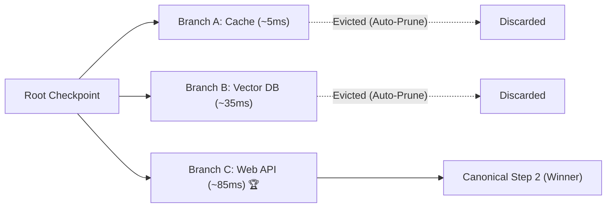

# Core Concepts & Architecture

This document explains the fundamental abstractions and mental model behind **RiftPoint**.

---

## 🌌 The Multiversal Mental Model

Traditional checkpointers (such as `MemorySaver` or `SqliteSaver`) model an agent's execution as a single linear sequence of state updates:

```text
[Step 1] ───> [Step 2] ───> [Step 3] ───> [Step 4]
```

When an agent needs to explore alternate strategies, standard checkpointers require manual cloning or creating separate disconnected threads, leading to $O(N \cdot S)$ memory duplication.

**RiftPoint** models state as a **Directed Acyclic Graph (DAG) of Realities** managed by the Rust [`janus-tachyon-rs`](https://github.com/goldenphoenix713/janus) engine:



---

## 🧩 Key Abstractions

### 1. Moments & Checkpoints

- **Moment:** The atomic unit of state at a discrete point in time in Janus. Each moment stores serialized channel values, version vectors, and parent lineage pointers.
- **Checkpoint Tuple:** LangGraph's standard representation of state (`checkpoint`, `metadata`, `parent_config`, `pending_writes`).

### 2. Timelines & Realities

- **`thread_id`:** The primary identifier for an agent workflow conversation.
- **`branch_name`:** An isolated timeline within a `thread_id` (e.g. `main`, `candidate_rag`, `speculative_code_v1`).
- **Composite Key:** In Janus, storage keys are indexed as `(thread_id, branch_name)`.

### 3. Copy-on-Write (CoW) Pointer Sharing

When forking from a parent checkpoint into 100 parallel candidate realities:

- RiftPoint **does not** clone Python dictionary objects with `copy.deepcopy`.
- Instead, [`copy_checkpoint_entry_cross_thread`](../reference/checkpointer.md) shares immutable serialized byte pointers inside Rust memory.
- Branch creation completes in **$0.4\text{ ms}$ constant time ($O(1)$)** regardless of whether the state payload is 10KB or 100MB.

### 4. Multiverse Collapse

- **Evaluation:** Evaluators inspect candidate branch outputs and assign scalar scores ($\in [0.0, 10.0]$).
- **Winner Promotion:** The highest-scoring candidate's checkpoint is committed to the canonical `main` timeline.
- **Atomic Pruning:** Non-winning candidate branches are evicted from Janus graph storage, freeing memory immediately.

---

## ⚡ Concurrency & Thread Safety

RiftPoint enforces multi-layered concurrency safety:

- **Synchronous Saver (`RiftCheckpointSaver`):** Fine-grained per-thread `threading.Lock` instances prevent cross-thread race conditions.
- **Asynchronous Saver (`AsyncRiftCheckpointSaver`):** Per-thread `asyncio.Lock` instances ensure non-blocking event-loop safety during concurrent `asyncio.gather` tasks.
- **Isolated Channel Values:** When a branch mutates channel values, changes remain strictly isolated to that candidate's namespace.
