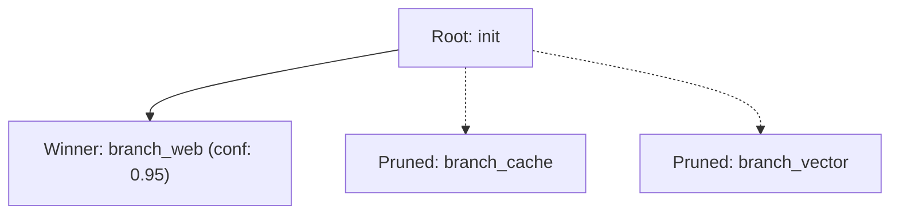

# Quickstart Tutorial

In this 5-minute walkthrough, we will create a simple LangGraph agent, fork its execution into parallel candidate branches, score the candidates, and collapse to the winning trajectory.

---

## Step 1: Define Your State and Graph

First, construct a standard LangGraph state graph.

```python
from typing import TypedDict
from langgraph.graph import StateGraph, START, END


class AgentState(TypedDict):
    query: str
    action: str
    result: str
    confidence: float


def process_node(state: AgentState) -> dict:
    action = state.get("action", "default")
    # Simulate action processing
    confidences = {"cache": 0.5, "vector": 0.8, "web": 0.95}
    return {
        "result": f"Executed strategy: {action}",
        "confidence": confidences.get(action, 0.6),
    }


builder = StateGraph(AgentState)
builder.add_node("process", process_node)
builder.add_edge(START, "process")
builder.add_edge("process", END)
```

---

## Step 2: Initialize RiftPoint Checkpointer

Replace the standard `MemorySaver` with `RiftCheckpointSaver`:

```python
from riftpoint import RiftCheckpointSaver

saver = RiftCheckpointSaver()
graph = builder.compile(checkpointer=saver)
```

---

## Step 3: Run the Initial Root State

Execute the initial user query:

```python
config = {"configurable": {"thread_id": "session-101"}}
initial_state = {
    "query": "What is quantum computing?",
    "action": "init",
    "result": "",
    "confidence": 0.0,
}

_ = graph.invoke(initial_state, config=config)
```

---

## Step 4: Speculative Branching & Parallel Execution

Now use `RiftRunner` to fork 3 candidate realities:

```python
from riftpoint import RiftRunner, BranchSpec

runner = RiftRunner(saver=saver)

specs = [
    BranchSpec(name="branch_cache", input_data={"action": "cache"}),
    BranchSpec(name="branch_vector", input_data={"action": "vector"}),
    BranchSpec(name="branch_web", input_data={"action": "web"}),
]

results = runner.run_parallel_branches(
    graph=graph,
    initial_config=config,
    branch_specs=specs,
)

for branch_name, res in results.items():
    print(f"[{branch_name}] Status: {res.is_success}, Result: {res.output['result']}")
```

---

## Step 5: Evaluate & Collapse the Multiverse

Use `MultiverseResolver` with an evaluator to commit the winning candidate and automatically prune discarded branches:

```python
from riftpoint import MultiverseResolver, HeuristicEvaluator

resolver = MultiverseResolver(saver=saver, branch_manager=runner.branch_manager)

# Define evaluation scoring function
evaluator = HeuristicEvaluator(
    scorer=lambda r: float(r.output.get("confidence", 0.0) if r.output else 0.0)
)

collapse_result = resolver.collapse(
    thread_id="session-101",
    results=results,
    evaluator=evaluator,
    prune_discarded=True,
)

print(f"🏆 Winning Reality: {collapse_result.winning_branch}")
print(f"Final State on 'session-101': {collapse_result.winning_result.output}")
```

---

## Step 6: Visualize the Timeline DAG

Generate a Mermaid.js diagram of the execution lineage:

```python
diagram = saver.visualize("session-101")
print(diagram)
```



---

## Next Steps

Explore the detailed [User Guides](../guides/speculative-racing.md) to learn about asynchronous execution, complex evaluators, and time travel.
