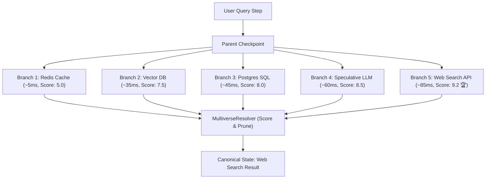

# Speculative Tool Racing

In production agent applications, agents often must choose between querying different data sources (e.g. local cache, vector database, SQL database, small draft LLM, or live search API).

Instead of running slow sequential fallback loops (e.g. Try Cache $\to$ If None, Try Vector DB $\to$ If Stale, Try Web Search), **RiftPoint** enables **concurrent speculative racing**.

---

## 🏎️ The Speculative Racing Architecture



---

## 💻 Implementation Example

```python
from riftpoint import (
    AsyncRiftCheckpointSaver,
    RiftRunner,
    MultiverseResolver,
    BranchSpec,
    HeuristicEvaluator,
)

saver = AsyncRiftCheckpointSaver()
runner = RiftRunner(saver=saver)
resolver = MultiverseResolver(saver=saver, branch_manager=runner.branch_manager)

# 1. Define candidate tool specs
branch_specs = [
    BranchSpec(name="local_cache", input_data={"tool": "redis", "query": "auth_token"}),
    BranchSpec(
        name="vector_search", input_data={"tool": "pinecone", "query": "auth_token"}
    ),
    BranchSpec(name="sql_db", input_data={"tool": "postgres", "query": "auth_token"}),
    BranchSpec(
        name="speculative_llm", input_data={"tool": "draft_llm", "query": "auth_token"}
    ),
    BranchSpec(
        name="web_search", input_data={"tool": "brave_search", "query": "auth_token"}
    ),
]

# 2. Concurrently execute all candidate tool strategies
results = await runner.arun_parallel_branches(
    graph=graph,
    initial_config=root_config,
    branch_specs=branch_specs,
)

# 3. Collapse to winning strategy and auto-prune non-winners
collapse_res = await resolver.acollapse(
    thread_id="user_session_42",
    results=results,
    evaluator=HeuristicEvaluator(
        scorer=lambda r: float(
            r.output.get("quality_score", 0.0) if r.is_success else 0.0
        )
    ),
    prune_discarded=True,
)

print(
    f"Winner: {collapse_res.winning_branch} (Score: {collapse_res.scores[collapse_res.winning_branch].score})"
)
```

---

## 🛡️ Fault Tolerance & Isolation

If an external tool encounters an HTTP 500 error or rate limit, RiftPoint isolates the failure inside that candidate branch. The `MultiverseResolver` automatically routes to the highest-scoring successful candidate, preventing agent crashes.
