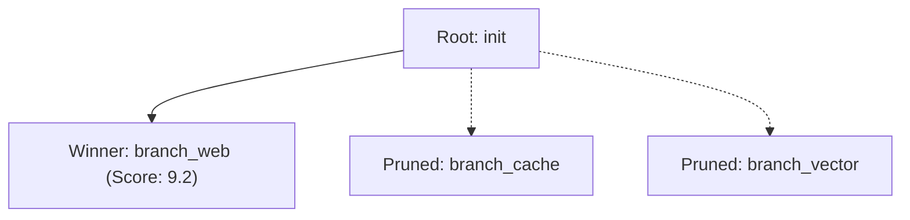

# Timeline Visualization & Tracing

RiftPoint includes built-in visualization tools to render timeline DAG lineages as **Mermaid.js** diagrams or **Matplotlib** graphs.

---

## 🧜 Mermaid.js Diagram Generation

Generate markdown Mermaid diagrams directly from your checkpointer instance:

```python
diagram = saver.visualize("session-1")
print(diagram)
```

**Example Output:**



---

## 📊 Matplotlib DAG Plotting

Render high-resolution visual plots:

```python
# Save DAG plot to PNG
saver.plot("session-1", output_path="timeline_dag.png")
```

---

## 💻 Standalone Visualization Modules

You can also use the visualization functions directly:

```python
from riftpoint.visualization import render_mermaid, plot_multiverse

# Generate Mermaid string from checkpointer
mermaid_str = render_mermaid(saver, thread_id="session-1")

# Render Matplotlib figure
plot_result = plot_multiverse(
    saver, thread_id="session-1", output_path="timeline_dag.png"
)
```
